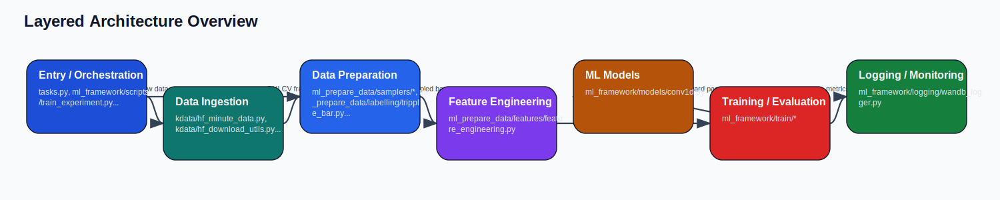
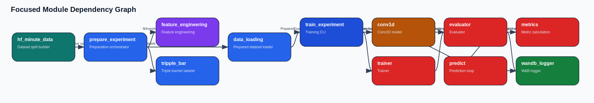
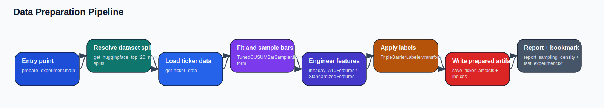
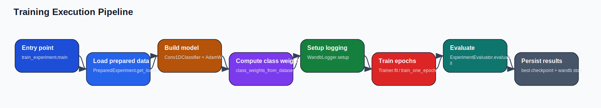
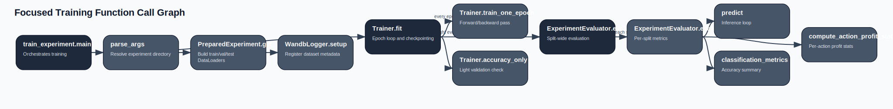

# Architecture Documentation

## System Overview

The repository is organized around a two-stage quant research workflow: a data preparation pipeline under `kvant.ml_prepare_data` and a model training/evaluation pipeline under `kvant.ml_framework`. Raw minute OHLCV data is sourced from Hugging Face dataset shards, transformed into prepared experiment artifacts on disk, then consumed by a PyTorch training loop with W&B-based reporting.

## Repository Structure

```text
Fagprojekt_DayTrading/
├── .devcontainer/
│   ├── devcontainer.json
│   └── post_create.sh
├── .github/
│   ├── agents/
│   │   └── dtu_mlops_agent.md
│   ├── prompts/
│   │   └── add_test.prompt.md
│   ├── workflows/
│   │   ├── linting.yaml
│   │   └── tests.yaml
│   └── dependabot.yaml
├── configs/
│   └── .gitkeep
├── dockerfiles/
│   ├── api.dockerfile
│   └── train.dockerfile
├── docs/
│   ├── generated/
│   │   ├── architecture_documentation.md
│   │   ├── architecture_documentation.pdf
│   │   ├── architecture_overview.svg
│   │   ├── data_pipeline.svg
│   │   ├── function_call_graph.svg
│   │   ├── module_dependency_graph.svg
│   │   └── training_pipeline.svg
│   ├── source/
│   │   └── index.md
│   ├── generate_architecture_docs.py
│   ├── mkdocs.yaml
│   └── README.md
├── models/
│   └── .gitkeep
├── notebooks/
│   └── .gitkeep
├── reports/
│   ├── figures/
│   │   └── .gitkeep
│   └── .gitkeep
├── src/
│   └── kvant/
│       ├── kdata/
│       │   ├── __init__.py
│       │   ├── data_vectorbt_example.py
│       │   ├── hf_download_utils.py
│       │   └── hf_minute_data.py
│       ├── kmarket_info/
│       │   ├── __init__.py
│       │   └── is_nyse_open.py
│       ├── ml_framework/
│       │   ├── logging/
│       │   ├── models/
│       │   ├── scripts/
│       │   ├── train/
│       │   └── __init__.py
│       ├── ml_prepare_data/
│       │   ├── features/
│       │   ├── labelling/
│       │   ├── plot_labelling/
│       │   ├── samplers/
│       │   ├── __init__.py
│       │   ├── data_loading.py
│       │   ├── data_loading_utils.py
│       │   ├── dataset_preparation_utils.py
│       │   ├── prepare_experiment.py
│       │   └── reporting.py
│       ├── __init__.py
│       └── labelling.py
├── tests/
│   ├── __init__.py
│   ├── test_api.py
│   ├── test_data.py
│   └── test_model.py
├── .gitignore
├── .pre-commit-config.yaml
├── .python-version
├── AGENTS.md
├── LICENSE
├── pyproject.toml
├── README.md
├── tasks.py
└── uv.lock
```

## Entry Points

- `kvant.kdata.data_vectorbt_example`: src/kvant/kdata/data_vectorbt_example.py (__main__)
- `kvant.kdata.hf_minute_data`: src/kvant/kdata/hf_minute_data.py (__main__)
- `kvant.ml_framework.scripts.train_experiment`: src/kvant/ml_framework/scripts/train_experiment.py (__main__)
- `kvant.ml_framework.scripts.train_experiment`: Training CLI
- `kvant.ml_prepare_data.plot_labelling.vary_labeller_runs`: src/kvant/ml_prepare_data/plot_labelling/vary_labeller_runs.py (__main__)
- `kvant.ml_prepare_data.plot_labelling.vary_labeller_runs`: Labelling sweep CLI
- `kvant.ml_prepare_data.plot_labelling.vary_labeller_runs_plot`: src/kvant/ml_prepare_data/plot_labelling/vary_labeller_runs_plot.py (__main__)
- `kvant.ml_prepare_data.prepare_experiment`: src/kvant/ml_prepare_data/prepare_experiment.py (__main__)
- `kvant.ml_prepare_data.prepare_experiment`: Data preparation CLI
- `tasks`: Invoke tasks

## Architecture Layers



### Entry / Orchestration

`kvant.ml_framework.scripts.__init__`, `kvant.ml_framework.scripts.train_experiment`, `tasks`

### Data Ingestion

`kvant.kdata.__init__`, `kvant.kdata.data_vectorbt_example`, `kvant.kdata.hf_download_utils`, `kvant.kdata.hf_minute_data`

### Market Calendar

`kvant.kmarket_info.__init__`, `kvant.kmarket_info.is_nyse_open`

### Data Preparation

`kvant.labelling`, `kvant.ml_prepare_data.__init__`, `kvant.ml_prepare_data.data_loading`, `kvant.ml_prepare_data.data_loading_utils`, `kvant.ml_prepare_data.dataset_preparation_utils`, `kvant.ml_prepare_data.labelling.__init__`, `kvant.ml_prepare_data.labelling.tripple_bar`, `kvant.ml_prepare_data.prepare_experiment`, `kvant.ml_prepare_data.reporting`, `kvant.ml_prepare_data.samplers.__init__`, `kvant.ml_prepare_data.samplers.sampler_cumsum`, `kvant.ml_prepare_data.samplers.sampling`

### Feature Engineering

`kvant.ml_prepare_data.features.__init__`, `kvant.ml_prepare_data.features.feature_engineering`

### ML Models

`kvant.ml_framework.models.__init__`, `kvant.ml_framework.models.conv1d`

### Training / Evaluation

`kvant.ml_framework.__init__`, `kvant.ml_framework.train.__init__`, `kvant.ml_framework.train.evaluator`, `kvant.ml_framework.train.metrics`, `kvant.ml_framework.train.predict`, `kvant.ml_framework.train.trainer`, `kvant.ml_framework.train.utils`

### Logging / Monitoring

`kvant.ml_framework.logging.__init__`, `kvant.ml_framework.logging.wandb_logger`

### Analysis Utilities

`kvant.ml_prepare_data.plot_labelling.vary_labeller_runs`, `kvant.ml_prepare_data.plot_labelling.vary_labeller_runs_plot`

### Core Package

`kvant.__init__`

## Dependency Graph



This graph is intentionally focused on the modules that shape the end-to-end training workflow. It omits package marker files and low-signal helper modules to keep the node count readable.

## Execution Pipelines

### Data Preparation Pipeline



### Training Pipeline



### Pipeline Trace

- **Data entry**: `src/kvant/ml_prepare_data/prepare_experiment.py:main()` discovers a dataset split and loads per-ticker OHLCV frames.
- **Sampling**: `TunedCUSUMBarSampler.fit/transform()` reduces dense minute data to event bars.
- **Features**: `IntradayTA10Features` and `StandardizedFeatures` convert bars into model-ready features.
- **Labels**: `TripleBarrierLabeler.transform()` assigns targets and metadata for downstream profit analysis.
- **Prepared artifacts**: `prepare_experiment()` writes ticker arrays plus split indices into `src/kvant/ml_framework/prepared/`.
- **Training entry**: `src/kvant/ml_framework/scripts/train_experiment.py:main()` reads the latest prepared experiment.
- **Training loop**: `Trainer.fit()` trains `Conv1DClassifier`, checkpoints by validation accuracy, and triggers periodic evaluation.
- **Evaluation and logging**: `ExperimentEvaluator` computes metrics and `WandbLogger` publishes split and ticker-level diagnostics.

## Function Call Graph



This is a focused call graph centered on the training entrypoint and the evaluation stack. Static tools were used to inspect the repository, but the final visualization is reduced to the cross-module calls that matter operationally.

## File-by-File Documentation

### File: `src/kvant/__init__.py`

**Purpose**
Package marker for kvant.__init__.

**Inputs**
- `Package import only`
- External dependencies: `os`

**Outputs**
- Package marker with no direct runtime output.

**Key Functions**

### File: `src/kvant/kdata/__init__.py`

**Purpose**
Package marker for kvant.kdata.__init__.

**Inputs**
- `Package import only`
- External dependencies: `none`

**Outputs**
- Package marker with no direct runtime output.

**Key Functions**

### File: `src/kvant/kdata/data_vectorbt_example.py`

**Purpose**
Implements the data vectorbt example module in the Data Ingestion layer.

**Inputs**
- `run_ma_crossover(close: pd.Series) -> vbt.Portfolio`
- `main()`
- External dependencies: `pandas, vectorbt`

**Outputs**
- run_ma_crossover: vbt.Portfolio
- main: untyped return
- Side effects: filesystem reads, stdout logging

**Key Functions**
- `run_ma_crossover(close: pd.Series) -> vbt.Portfolio`
- `main()`

### File: `src/kvant/kdata/hf_download_utils.py`

**Purpose**
Loads monthly dataset shards from Hugging Face into pandas DataFrames.

**Inputs**
- `load_one_month(month_file: str) -> pd.DataFrame`
- External dependencies: `pandas`

**Outputs**
- load_one_month: pd.DataFrame
- Side effects: filesystem reads, network / remote data, stdout logging

**Key Functions**
- `load_one_month(month_file: str) -> pd.DataFrame`

### File: `src/kvant/kdata/hf_minute_data.py`

**Purpose**
Downloads, filters, and organizes minute-level OHLCV dataset splits from Hugging Face.

**Inputs**
- `get_dataset_file(repo_id: str, filename: str) -> str`
- `get_raw_monthly_data(year, month_zero_indexed)`
- `prepare_single_ticker(month_file: str, ticker: str, impute_missing_minutes = True) -> dict[str, pd.DataFrame]`
- External dependencies: `hashlib, os, pandas, pyarrow, tqdm`

**Outputs**
- get_dataset_file: str
- get_raw_monthly_data: untyped return
- prepare_single_ticker: dict[str, pd.DataFrame]
- Side effects: filesystem reads, filesystem writes, network / remote data, stdout logging, visual reporting

**Key Functions**
- `get_dataset_file(repo_id: str, filename: str) -> str`
- `get_raw_monthly_data(year, month_zero_indexed)`
- `prepare_single_ticker(month_file: str, ticker: str, impute_missing_minutes = True) -> dict[str, pd.DataFrame]`
- `google_1_month()`

### File: `src/kvant/kmarket_info/__init__.py`

**Purpose**
Package marker for kvant.kmarket_info.__init__.

**Inputs**
- `Package import only`
- External dependencies: `none`

**Outputs**
- Package marker with no direct runtime output.

**Key Functions**

### File: `src/kvant/kmarket_info/is_nyse_open.py`

**Purpose**
Checks whether timestamps fall inside the NYSE trading window.

**Inputs**
- `nyse_trade_window_is_valid(entry_ts_utc: pd.Timestamp, exit_ts_utc: pd.Timestamp) -> bool`
- `is_nyse_available(dt, minutes_after_open: int = 10, minutes_before_close: int = 10) -> bool`
- External dependencies: `pandas, pandas_market_calendars`

**Outputs**
- nyse_trade_window_is_valid: bool
- is_nyse_available: bool

**Key Functions**
- `nyse_trade_window_is_valid(entry_ts_utc: pd.Timestamp, exit_ts_utc: pd.Timestamp) -> bool`
- `is_nyse_available(dt, minutes_after_open: int = 10, minutes_before_close: int = 10) -> bool`

### File: `src/kvant/labelling.py`

**Purpose**
Provides the low-level triple-barrier labeling routine used by the labeler.

**Inputs**
- `_to_utc_ts(x: Union[pd.Timestamp, str]) -> pd.Timestamp`
- `tripple_bar_label(data: pd.DataFrame, time_start: Union[pd.Timestamp, str], width: int, height: float) -> Optional[TripleBarLabel]`
- External dependencies: `dataclasses, numpy, pandas`

**Outputs**
- _to_utc_ts: pd.Timestamp
- tripple_bar_label: Optional[TripleBarLabel]
- Side effects: filesystem reads

**Key Functions**
- `_to_utc_ts(x: Union[pd.Timestamp, str]) -> pd.Timestamp`
- `tripple_bar_label(data: pd.DataFrame, time_start: Union[pd.Timestamp, str], width: int, height: float) -> Optional[TripleBarLabel]`

### File: `src/kvant/ml_framework/__init__.py`

**Purpose**
Package marker for kvant.ml_framework.__init__.

**Inputs**
- `Package import only`
- External dependencies: `none`

**Outputs**
- Side effects: model training

**Key Functions**

### File: `src/kvant/ml_framework/logging/__init__.py`

**Purpose**
Package marker for kvant.ml_framework.logging.__init__.

**Inputs**
- `Package import only`
- External dependencies: `none`

**Outputs**
- Package marker with no direct runtime output.

**Key Functions**

### File: `src/kvant/ml_framework/logging/wandb_logger.py`

**Purpose**
Sends training metrics, confusion charts, and per-ticker summaries to Weights & Biases.

**Inputs**
- `_safe_int(x: Any, default: int = 0) -> int`
- `_to_float_or_nan(x: Any) -> float`
- `_plot_confusion_heatmap(cm: np.ndarray, title: str) -> plt.Figure`
- `WandbLogger.__init__(self, *, project: str, name: Optional[str] = None, config: Optional[Dict[str, Any]] = None, **init_kwargs)`
- External dependencies: `matplotlib, numpy, wandb`

**Outputs**
- _safe_int: int
- _to_float_or_nan: float
- _plot_confusion_heatmap: plt.Figure
- Side effects: network / remote data, visual reporting

**Key Functions**
- `_safe_int(x: Any, default: int = 0) -> int`
- `_to_float_or_nan(x: Any) -> float`
- `_plot_confusion_heatmap(cm: np.ndarray, title: str) -> plt.Figure`
- `WandbLogger.__init__(self, *, project: str, name: Optional[str] = None, config: Optional[Dict[str, Any]] = None, **init_kwargs)`
- `WandbLogger.log_config(self, cfg: Any) -> None`

### File: `src/kvant/ml_framework/models/__init__.py`

**Purpose**
Package marker for kvant.ml_framework.models.__init__.

**Inputs**
- `Package import only`
- External dependencies: `none`

**Outputs**
- Package marker with no direct runtime output.

**Key Functions**

### File: `src/kvant/ml_framework/models/conv1d.py`

**Purpose**
Defines the Conv1D classification model used by the training pipeline.

**Inputs**
- `Conv1DClassifier.__init__(self, n_features: int, n_classes: int = 3)`
- External dependencies: `torch`

**Outputs**
- Package marker with no direct runtime output.

**Key Functions**
- `Conv1DClassifier.__init__(self, n_features: int, n_classes: int = 3)`
- `Conv1DClassifier.forward(self, x: torch.Tensor) -> torch.Tensor`

### File: `src/kvant/ml_framework/scripts/__init__.py`

**Purpose**
Package marker for kvant.ml_framework.scripts.__init__.

**Inputs**
- `Package import only`
- External dependencies: `none`

**Outputs**
- Package marker with no direct runtime output.

**Key Functions**

### File: `src/kvant/ml_framework/scripts/train_experiment.py`

**Purpose**
CLI entrypoint for loading a prepared experiment, training the Conv1D classifier, and running final evaluation.

**Inputs**
- `parse_args() -> argparse.Namespace`
- `main() -> None`
- External dependencies: `argparse, os, torch`

**Outputs**
- parse_args: argparse.Namespace
- main: None
- Side effects: filesystem reads, model training, stdout logging

**Key Functions**
- `parse_args() -> argparse.Namespace`
- `main() -> None`

### File: `src/kvant/ml_framework/train/__init__.py`

**Purpose**
Package marker for kvant.ml_framework.train.__init__.

**Inputs**
- `Package import only`
- External dependencies: `none`

**Outputs**
- Side effects: model training

**Key Functions**

### File: `src/kvant/ml_framework/train/evaluator.py`

**Purpose**
Computes split-level metrics, per-ticker metrics, confusion matrices, and profit summaries.

**Inputs**
- `ExperimentEvaluator.__init__(self, *, store: PreparedStore, device: torch.device, cfg: EvalConfig = EvalConfig(), logger: Optional[Any] = None)`
- External dependencies: `numpy, torch`

**Outputs**
- Package marker with no direct runtime output.

**Key Functions**
- `ExperimentEvaluator.__init__(self, *, store: PreparedStore, device: torch.device, cfg: EvalConfig = EvalConfig(), logger: Optional[Any] = None)`
- `ExperimentEvaluator.evaluate_split(self, split: str, model: torch.nn.Module, loader: DataLoader, *, step: Optional[int] = None) -> Tuple[Dict[str, Any], List[Dict[str, Any]], np.ndarray]`

### File: `src/kvant/ml_framework/train/metrics.py`

**Purpose**
Aggregates classification and profit-oriented evaluation metrics.

**Inputs**
- `classification_metrics(y_true: np.ndarray, y_pred: np.ndarray) -> Dict[str, Any]`
- `per_ticker_trade_stats(*, y_pred: np.ndarray, metas: List[Optional[dict]], tids: np.ndarray) -> Dict[int, Dict[str, Any]]`
- `compute_return_stats(*, y_pred: np.ndarray, metas: List[Optional[dict]], tids: Optional[np.ndarray] = None) -> Dict[str, Any]`
- External dependencies: `numpy`

**Outputs**
- classification_metrics: Dict[str, Any]
- per_ticker_trade_stats: Dict[int, Dict[str, Any]]
- compute_return_stats: Dict[str, Any]

**Key Functions**
- `classification_metrics(y_true: np.ndarray, y_pred: np.ndarray) -> Dict[str, Any]`
- `per_ticker_trade_stats(*, y_pred: np.ndarray, metas: List[Optional[dict]], tids: np.ndarray) -> Dict[int, Dict[str, Any]]`
- `compute_return_stats(*, y_pred: np.ndarray, metas: List[Optional[dict]], tids: Optional[np.ndarray] = None) -> Dict[str, Any]`
- `compute_action_profit_stats(*, y_pred: np.ndarray, metas: List[Optional[dict]], tids: np.ndarray) -> Dict[int, Dict[str, Any]]`

### File: `src/kvant/ml_framework/train/predict.py`

**Purpose**
Runs batched inference and returns aligned predictions, labels, and sample identifiers.

**Inputs**
- `predict(model: torch.nn.Module, loader: DataLoader, device: torch.device) -> Dict[str, Any]`
- External dependencies: `numpy, torch`

**Outputs**
- predict: Dict[str, Any]

**Key Functions**
- `predict(model: torch.nn.Module, loader: DataLoader, device: torch.device) -> Dict[str, Any]`

### File: `src/kvant/ml_framework/train/trainer.py`

**Purpose**
Runs epoch training loops, checkpoint selection, and periodic evaluation.

**Inputs**
- `Trainer.__init__(self, *, model: torch.nn.Module, optimizer: torch.optim.Optimizer, criterion: torch.nn.Module, device: torch.device, evaluator: Optional[ExperimentEvaluator] = None, logger: Optional[Any] = None)`
- External dependencies: `torch`

**Outputs**
- Side effects: model training, stdout logging

**Key Functions**
- `Trainer.__init__(self, *, model: torch.nn.Module, optimizer: torch.optim.Optimizer, criterion: torch.nn.Module, device: torch.device, evaluator: Optional[ExperimentEvaluator] = None, logger: Optional[Any] = None)`
- `Trainer.train_one_epoch(self, loader: DataLoader) -> float`

### File: `src/kvant/ml_framework/train/utils.py`

**Purpose**
Implements the utils module in the Training / Evaluation layer.

**Inputs**
- `class_weights_from_dataset(ds: Dataset, n_classes: int = 3) -> np.ndarray`
- External dependencies: `numpy, torch`

**Outputs**
- class_weights_from_dataset: np.ndarray

**Key Functions**
- `class_weights_from_dataset(ds: Dataset, n_classes: int = 3) -> np.ndarray`

### File: `src/kvant/ml_prepare_data/__init__.py`

**Purpose**
Package marker for kvant.ml_prepare_data.__init__.

**Inputs**
- `Package import only`
- External dependencies: `os`

**Outputs**
- Package marker with no direct runtime output.

**Key Functions**

### File: `src/kvant/ml_prepare_data/data_loading.py`

**Purpose**
Loads a prepared experiment from disk and exposes PyTorch datasets and loaders for each split.

**Inputs**
- `_load_jsonl(path: Path) -> List[Optional[dict]]`
- `PreparedStore.__init__(self, exp_dir: Path)`
- `IndexWindowDataset.__init__(self, store: PreparedStore, index: np.ndarray, lookback_L: int)`
- External dependencies: `json, numpy, os, torch`

**Outputs**
- _load_jsonl: List[Optional[dict]]
- Side effects: filesystem reads

**Key Functions**
- `_load_jsonl(path: Path) -> List[Optional[dict]]`
- `PreparedStore.__init__(self, exp_dir: Path)`
- `PreparedStore.window_and_label(self, tid: int, tpos: int, L: int) -> Tuple[np.ndarray, int]`
- `IndexWindowDataset.__init__(self, store: PreparedStore, index: np.ndarray, lookback_L: int)`
- `IndexWindowDataset.__len__(self) -> int`

### File: `src/kvant/ml_prepare_data/data_loading_utils.py`

**Purpose**
Implements the data loading utils module in the Data Preparation layer.

**Inputs**
- `summary(self, display: bool = True) -> Dict[str, Any]`
- External dependencies: `numpy`

**Outputs**
- summary: Dict[str, Any]
- Side effects: stdout logging

**Key Functions**
- `summary(self, display: bool = True) -> Dict[str, Any]`

### File: `src/kvant/ml_prepare_data/dataset_preparation_utils.py`

**Purpose**
Implements the dataset preparation utils module in the Data Preparation layer.

**Inputs**
- `ensure_utc_sorted_index(df: pd.DataFrame) -> pd.DataFrame`
- External dependencies: `pandas`

**Outputs**
- ensure_utc_sorted_index: pd.DataFrame

**Key Functions**
- `ensure_utc_sorted_index(df: pd.DataFrame) -> pd.DataFrame`

### File: `src/kvant/ml_prepare_data/features/__init__.py`

**Purpose**
Package marker for kvant.ml_prepare_data.features.__init__.

**Inputs**
- `Package import only`
- External dependencies: `none`

**Outputs**
- Package marker with no direct runtime output.

**Key Functions**

### File: `src/kvant/ml_prepare_data/features/feature_engineering.py`

**Purpose**
Creates OHLCV and technical indicator features, with optional standardization.

**Inputs**
- `FeatureEngineer.fit(self, df: pd.DataFrame) -> 'FeatureEngineer'`
- `BaseDFEngineer.fit(self, df: pd.DataFrame) -> 'BaseDFEngineer'`
- External dependencies: `numpy, pandas`

**Outputs**
- Side effects: filesystem reads

**Key Functions**
- `FeatureEngineer.fit(self, df: pd.DataFrame) -> 'FeatureEngineer'`
- `FeatureEngineer.transform(self, df: pd.DataFrame) -> tuple[np.ndarray, list[str]]`
- `BaseDFEngineer.fit(self, df: pd.DataFrame) -> 'BaseDFEngineer'`
- `BaseDFEngineer.get_meta(self) -> dict`

### File: `src/kvant/ml_prepare_data/labelling/__init__.py`

**Purpose**
Package marker for kvant.ml_prepare_data.labelling.__init__.

**Inputs**
- `Package import only`
- External dependencies: `none`

**Outputs**
- Package marker with no direct runtime output.

**Key Functions**

### File: `src/kvant/ml_prepare_data/labelling/tripple_bar.py`

**Purpose**
Applies triple-barrier labeling and keeps per-sample metadata for later profit analysis.

**Inputs**
- `Labeler.fit(self, df: pd.DataFrame) -> 'Labeler'`
- `TripleBarrierLabeler.fit(self, df: pd.DataFrame) -> 'TripleBarrierLabeler'`
- External dependencies: `numpy, pandas, tqdm`

**Outputs**
- Package marker with no direct runtime output.

**Key Functions**
- `Labeler.fit(self, df: pd.DataFrame) -> 'Labeler'`
- `Labeler.transform(self, df: pd.DataFrame) -> tuple[np.ndarray, List[Optional[dict]]]`
- `TripleBarrierLabeler.fit(self, df: pd.DataFrame) -> 'TripleBarrierLabeler'`
- `TripleBarrierLabeler.transform(self, df: pd.DataFrame) -> tuple[np.ndarray, list[Optional[dict]]]`

### File: `src/kvant/ml_prepare_data/plot_labelling/vary_labeller_runs.py`

**Purpose**
Implements the vary labeller runs module in the Analysis Utilities layer.

**Inputs**
- `_stable_sweep_exp_id(prefix: str, payload: dict) -> str`
- `_empty_class_counts() -> Dict[str, int]`
- `_extract_per_ticker_counts_from_prepared(exp: PreparedExperiment) -> dict[str, Any]`
- External dependencies: `hashlib, json, numpy, pickle, shutil`

**Outputs**
- _stable_sweep_exp_id: str
- _empty_class_counts: Dict[str, int]
- _extract_per_ticker_counts_from_prepared: dict[str, Any]
- Side effects: filesystem reads, filesystem writes, stdout logging

**Key Functions**
- `_stable_sweep_exp_id(prefix: str, payload: dict) -> str`
- `_empty_class_counts() -> Dict[str, int]`
- `_extract_per_ticker_counts_from_prepared(exp: PreparedExperiment) -> dict[str, Any]`
- `run_sweep_and_save_pkl(*, downloaded_splits: list[DownloadedDatasetSplit], out_root_prepared: Path, out_pkl_path: Path, width_minutes_grid: List[int], height_grid: List[float], lookback_L: int = 200, subsample_every: int = 1, drop_time_exit_label: bool = False) -> Path`

### File: `src/kvant/ml_prepare_data/plot_labelling/vary_labeller_runs_plot.py`

**Purpose**
Implements the vary labeller runs plot module in the Analysis Utilities layer.

**Inputs**
- `_load_pkl(path: Path) -> dict[str, Any]`
- `_run_label(r: dict[str, Any]) -> str`
- `plot_per_ticker_split_counts(payload: dict[str, Any], *, split: str, out_path: Path | None = None)`
- External dependencies: `matplotlib, numpy, pickle`

**Outputs**
- _load_pkl: dict[str, Any]
- _run_label: str
- plot_per_ticker_split_counts: untyped return
- Side effects: filesystem reads, filesystem writes, stdout logging, visual reporting

**Key Functions**
- `_load_pkl(path: Path) -> dict[str, Any]`
- `_run_label(r: dict[str, Any]) -> str`
- `plot_per_ticker_split_counts(payload: dict[str, Any], *, split: str, out_path: Path | None = None)`
- `main()`

### File: `src/kvant/ml_prepare_data/prepare_experiment.py`

**Purpose**
Builds prepared train/validation/test datasets from raw ticker data, sampling, feature engineering, and labeling.

**Inputs**
- `valid_target_positions(labels: np.ndarray, lookback_L: int) -> np.ndarray`
- `_json_default(x)`
- `save_label_metadata_jsonl(tdir: Path, metadata: List[Optional[dict]]) -> None`
- `ExperimentConfig.stable_id(self) -> str`
- External dependencies: `hashlib, json, numpy, pandas, tqdm`

**Outputs**
- valid_target_positions: np.ndarray
- _json_default: untyped return
- save_label_metadata_jsonl: None
- Side effects: filesystem reads, filesystem writes, stdout logging, visual reporting

**Key Functions**
- `valid_target_positions(labels: np.ndarray, lookback_L: int) -> np.ndarray`
- `_json_default(x)`
- `save_label_metadata_jsonl(tdir: Path, metadata: List[Optional[dict]]) -> None`
- `save_ticker_artifacts(tdir: Path, X: np.ndarray, y: np.ndarray, ts: np.ndarray, meta: dict, label_metadata: Optional[list[Optional[dict]]] = None) -> None`
- `ExperimentConfig.stable_id(self) -> str`

### File: `src/kvant/ml_prepare_data/reporting.py`

**Purpose**
Generates dataset sampling density diagnostics and reports.

**Inputs**
- `_load_json(path: Path) -> dict`
- `_daily_sample_counts_from_timestamps(ts: np.ndarray) -> pd.Series`
- `_save_hist_png(values: np.ndarray, out_path: Path, title: str, bins: int = 50) -> None`
- External dependencies: `json, numpy, pandas`

**Outputs**
- _load_json: dict
- _daily_sample_counts_from_timestamps: pd.Series
- _save_hist_png: None
- Side effects: filesystem reads, filesystem writes, stdout logging, visual reporting

**Key Functions**
- `_load_json(path: Path) -> dict`
- `_daily_sample_counts_from_timestamps(ts: np.ndarray) -> pd.Series`
- `_save_hist_png(values: np.ndarray, out_path: Path, title: str, bins: int = 50) -> None`
- `report_sampling_density(exp_dir: Path, *, tickers: Optional[List[str]] = None, bins: int = 50, print_table: bool = True) -> pd.DataFrame`

### File: `src/kvant/ml_prepare_data/samplers/__init__.py`

**Purpose**
Package marker for kvant.ml_prepare_data.samplers.__init__.

**Inputs**
- `Package import only`
- External dependencies: `none`

**Outputs**
- Package marker with no direct runtime output.

**Key Functions**

### File: `src/kvant/ml_prepare_data/samplers/sampler_cumsum.py`

**Purpose**
Implements the tuned CUSUM sampler used to reduce minute bars into event bars.

**Inputs**
- `_cusum_event_ends(close: np.ndarray, h: float) -> np.ndarray`
- `_aggregate_ohlcv_segments(df: pd.DataFrame, ends: np.ndarray) -> pd.DataFrame`
- `_bars_per_day(df: pd.DataFrame, ends: np.ndarray) -> float`
- `TunedCUSUMBarSampler.fit(self, ticker_dfs_train: Dict[str, pd.DataFrame]) -> 'TunedCUSUMBarSampler'`
- External dependencies: `numpy, pandas`

**Outputs**
- _cusum_event_ends: np.ndarray
- _aggregate_ohlcv_segments: pd.DataFrame
- _bars_per_day: float
- Side effects: filesystem reads

**Key Functions**
- `_cusum_event_ends(close: np.ndarray, h: float) -> np.ndarray`
- `_aggregate_ohlcv_segments(df: pd.DataFrame, ends: np.ndarray) -> pd.DataFrame`
- `_bars_per_day(df: pd.DataFrame, ends: np.ndarray) -> float`
- `TunedCUSUMBarSampler.fit(self, ticker_dfs_train: Dict[str, pd.DataFrame]) -> 'TunedCUSUMBarSampler'`
- `TunedCUSUMBarSampler.get_global_meta(self) -> dict`

### File: `src/kvant/ml_prepare_data/samplers/sampling.py`

**Purpose**
Defines the sampler protocol and simple baseline samplers.

**Inputs**
- `BaseBarSampler.fit(self, ticker_dfs_train: Dict[str, pd.DataFrame]) -> 'BaseBarSampler'`
- `IdentitySampler.fit(self, ticker_dfs_train: Dict[str, pd.DataFrame]) -> 'IdentitySampler'`
- External dependencies: `pandas`

**Outputs**
- Package marker with no direct runtime output.

**Key Functions**
- `BaseBarSampler.fit(self, ticker_dfs_train: Dict[str, pd.DataFrame]) -> 'BaseBarSampler'`
- `BaseBarSampler.get_global_meta(self) -> dict`
- `IdentitySampler.fit(self, ticker_dfs_train: Dict[str, pd.DataFrame]) -> 'IdentitySampler'`
- `IdentitySampler.get_global_meta(self) -> dict`

### File: `tasks.py`

**Purpose**
Invoke task entrypoints for testing, Docker builds, and docs commands.

**Inputs**
- `preprocess_data(ctx: Context) -> None`
- `train(ctx: Context) -> None`
- `test(ctx: Context) -> None`
- External dependencies: `none`

**Outputs**
- preprocess_data: None
- train: None
- test: None

**Key Functions**
- `preprocess_data(ctx: Context) -> None`
- `train(ctx: Context) -> None`
- `test(ctx: Context) -> None`
- `docker_build(ctx: Context, progress: str = 'plain') -> None`
